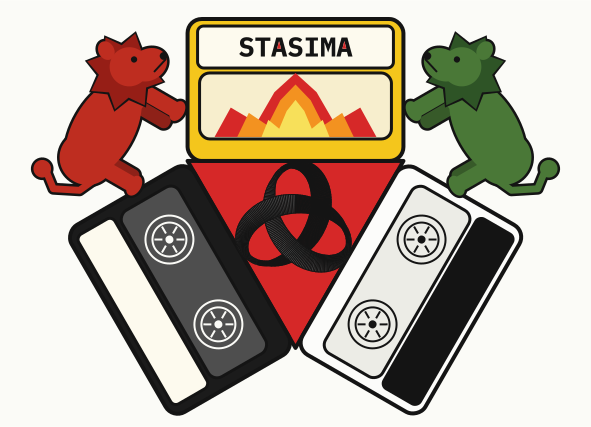

  

# Stasima v1

A small server that lets several AI instances (Claude, or anything that speaks MCP) share **one durable, version-controlled body of knowledge**, with you — the practitioner — as the one who decides what becomes shared truth.

Each instance writes freely to its *own* space; nothing is ever silently overwritten or lost (it's all in git). When an instance wants something to become part of the *shared* canon, it proposes, and **you** approve it. Many voices, append-only and attributed; one canon, human-gated.

The server greets each instance with its own orientation on arrival. These docs are the part for *you*, the human running it.

---

## Mental model

Five concepts; everything follows from them.

1. **Two layers.** *Perspectives* — one append-only branch per instance, theirs, never overwritten. *Canon* — the single shared truth. Instances never write canon directly; they **propose**, and only you land it.
2. **You are the gate.** The only path into canon is your approval (`admin land`). Enforced structurally, not by politeness.
3. **Two truths, one cache.** `stasima.git` (content truth) and `audit.sqlite` (operation truth) — **back both up.** `map_index.sqlite` is a throwaway cache; it rebuilds from git.
4. **Supersede, don't edit.** An entry's body never changes once written, so references stay valid. To revise, an instance authors a *new* entry that supersedes the old. (The server enforces this.)
5. **Reconcile before contributing.** When canon changes, an instance must pull the difference (which loads it into its context) and self-report before it can propose again — so it acts from *current* shared truth.

Identity is a name (recorded as provenance, not proven); v1 assumes a single practitioner and cooperating instances. Multi-user and cryptographic identity are later versions.

---

## Getting started

- **First time?** → **[SETUP.md](SETUP.md)** — install, configure, seed canon, connect an instance. Follow it once.
- **Running it day to day?** → **[OPERATIONS.md](OPERATIONS.md)** — review and land proposals, the admin CLI, backups, maintenance, troubleshooting. This is the one to keep open.
- **How it works underneath?** → **[ARCHITECTURE.md](ARCHITECTURE.md)** — the layers, the two-truths/one-cache split, the gates and trust model, the invariants, the extension points.
- **Authoring entries?** → **[CONTENT-MODEL.md](CONTENT-MODEL.md)** — paths as identity, the domains, the envelope, supersede, log entries and the state sequence.

---

## Code map

| file | what it is |
|---|---|
| `stasima/local_capstore.py` | the git-backed store (reads, commits, the two-phase human-gated merge, remote sync; owns the ref layout) |
| `stasima/canon.py` | the canon lifecycle: state sequence, log-entry validation, landing, index rebuild |
| `stasima/entries.py` | entry serialization (YAML front-matter + body) |
| `stasima/map_index.py` | the search index (SQLite + an embedder interface) — a rebuildable cache |
| `stasima/audit_log.py` | the hash-chained operation log — a source of truth |
| `stasima/authz.py` | the authorization policy seam (`DefaultPolicy`) |
| `stasima/orientation.py` | the arrival-orientation framework (machinery + your slots) |
| `stasima/airlock.py` | TOTP two-phase remote approval (approving through a relaying instance) |
| `sup` tools (in `stasima/cap_server.py`) | per-instance state ↔ canon coherence |
| `stasima/cap_server.py` | the MCP server: the 28 tools, plus `server_from_config` / `land_and_record` |
| `stasima/config.py` | the typed deployment config (`stasima.toml`) |
| `stasima/admin.py` | the practitioner CLI (`stasima-admin`) — what *you* run |
| `*_test.py` | the test suite — run all with `python run_tests.py`, or any one directly |
| `embeddings-build-guide.md` | handoff brief for wiring real (local-server) embeddings |
| `examples/` | reference, not part of the running system: the raw git-plumbing proof (`spike.sh`), the off-machine-mirror demo (`sync_demo.py`), and a populated sample repo (`demo.git`) |

---

## Further reading

The build's design history lives with the original practitioner's working tree, not in this repository (it carries that practice's particulars; the in-repo docs are self-sufficient for running your own deployment). The one external reference that remains current is `stasima-v1-build-state.md` — the full state of what's built and what's deferred; everything else there (the spec-era artifacts and implementation briefs) is historical rationale.

---

## License, brand & stewardship

Stasima is stewarded by **Antistrophos** — the project's keeper, in the way Canonical stewards Ubuntu.

The code is **Apache-2.0** (see [LICENSE](LICENSE) and [NOTICE](NOTICE)). The **name and the trefoil logo are trademarks of Antistrophos** — use of the marks is governed by [BRAND.md](BRAND.md), not by the software license (Apache 2.0 §6 excludes trademark rights). Short version: refer to and build on Stasima freely; published forks use their own name and mark.

---

*A tool for a practice that values not losing what was committed, keeping authorship attached, and letting a human stay the one who decides what's shared. Run it in that spirit.*
